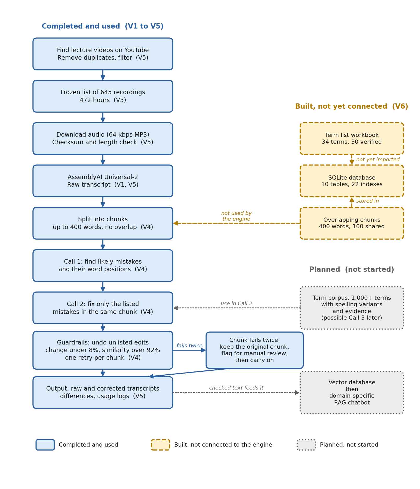
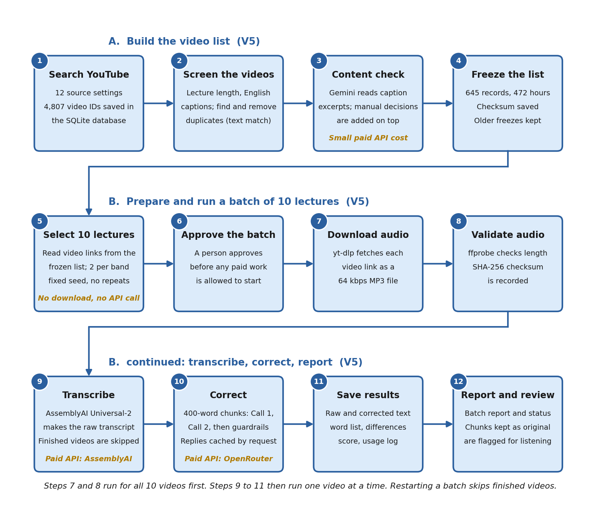
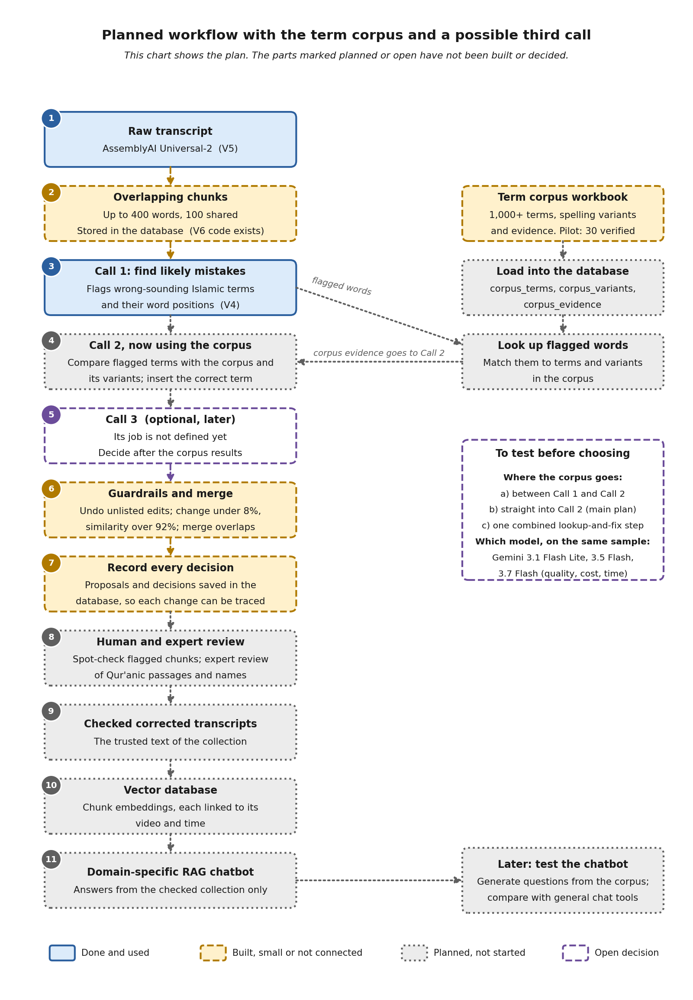

# Improving LLM Fairness and Factuality through Domain-Specific Retrieval

## Technical Report: Transcription and Corpus Pipeline for Islamic Lectures

**Author:** Sumaya Hashim, SMART Labs
**Date:** 20 September 2026
**Status:** Work paused and handed over for someone else to continue
**Code repository:** `improving-llm-fairness-factuality-domain-specific-retrieval` (code only: no audio, transcripts, databases or passwords)

---

## Summary

This project built the first layer of a future question-answering system about Islamic topics. That layer is a clean, traceable collection of lecture text by Shaykh Abdal Hakim Murad (Timothy Winter).

In short, the project:

- compared five speech-to-text tools on one lecture;
- built a careful two-step AI correction process for Arabic and Islamic words, with checks that stop the AI from rewriting the speaker's words;
- collected and froze a list of 645 recordings (about 472 hours); and
- started a database and a list of verified Islamic terms.

**What is finished**

- The five-tool comparison, on one lecture.
- The two-step correction process, used on 26 videos in three paid runs (Section 12).
- The frozen list of 645 recordings, with older versions kept.
- 283 draft question-and-answer exchanges taken from 34 videos.
- The database design, and code that splits text into overlapping chunks.
- A term list with 34 terms entered, 30 of them checked against audio.

**What is not finished, and is not claimed here**

- **No fairness work is covered.** The project title includes fairness, but the work in this report is about factuality and the domain-specific text layer. No fairness measurement or evaluation was done.
- There is **no chatbot**. Nothing has been tested on retrieval or answer quality, and nothing has been compared with general chat tools.
- There is **no measured accuracy**. The scores in this report show how much two texts agree, or how little the AI changed. They do not show how correct the text is (Section 10).
- The overlapping-chunk code and the term list are **not yet connected** to the process that produced the transcripts.
- The term list has 30 checked terms. The first target was 50, and the long-term target is 1,000 or more.
- 282 of the 283 question-and-answer exchanges have not been checked by a person.

---

## 1. Goal

The project asks one question: can a collection of lecture text on one subject, plus a tightly controlled correction process, give more reliable answers on specialist Islamic topics than general chat tools?

Text quality came first, ahead of speed. Splitting the text into chunks was fine if it gave better text.

Ordinary speech-to-text often gets Qur'anic phrases, Arabic and Islamic terms, names and honorifics wrong. An AI language model asked to fix them tends to rewrite sentences, cut words off, or delete honorifics. So the project worked on three things: choosing a speech-to-text tool, correcting only what is clearly wrong, and proving that nothing else changed.

The intended end result is a domain-specific RAG chatbot built on a vector database of the checked text (Section 13.0). Only the first layer has been built. Search, answer writing and testing against general chat tools have not been started.

## 2. How the pipeline works

The flowchart below shows the whole pipeline. Solid blue boxes are finished and were used to produce the results in this report. Dashed yellow boxes were built but are not connected to the correction engine. Dotted grey boxes are planned and have not been started.



*Figure 1. The pipeline. Labels V1 to V6 show which version folder holds each part.*

### The step-by-step work flow

Figure 2 shows the same work as a numbered sequence, from finding a video link in the database to the finished, reviewed transcript. Steps 1 to 4 build the frozen list of videos. Steps 5 to 12 process one batch of ten lectures from that list.



*Figure 2. The 12-step work flow. Amber notes mark the steps that use a paid service.*

| Steps | What runs |
|---|---|
| 1 to 4 | The V5 discovery, screening, duplicate-check and freeze scripts (see the V5 README) |
| 5 | `prepare_lecture_expansion_batch.py`: reads the frozen list, picks 10 lectures, and writes a proposed selection. It never downloads audio or calls a paid service |
| 6 | `run_lecture_expansion_batch.py --approve`: records that a person approved the batch |
| 7 and 8 | `prepare_audio_pilot.py` download and check functions, called by the batch runner: yt-dlp download, ffprobe length check, SHA-256 checksum |
| 9 to 11 | `run_fresh_benchmark.py` for one video, which calls AssemblyAI and then the two-call engine `two_call_pipeline.py` |
| 12 | The batch runner writes the batch report and status file. Chunks kept as the original text are flagged for a listening check |

The work was done in six versions. This report describes all six. The code repository publishes only the code that is still needed (the last column):

| Folder | What it holds | Status | In the repository |
|---|---|---|---|
| `v1_transcription_tool_comparison` | Comparison of speech-to-text tools | Early experiment | No, described in this report only |
| `v2_assemblyai_llm_free_models` | First AI correction, using free models | Early experiment | No, described in this report only |
| `v3_assemblyai_llm_ab_prompt_test` | Test of two prompts, one with a word list | Early experiment, not used further | No, described in this report only |
| `v4_assemblyai_two_call_pipeline` | The final two-step correction engine | Core | Yes |
| `v5_batch_ingestion_pipeline` | Finding videos, freezing the list, batch runs, question-and-answer extraction | Core | Batch-run code only (5 scripts and 3 tests); dataset and dialogue scripts are in `tools/` |
| `v6_corpus_aware_pipeline` | Overlapping chunks, database, term-list checker | Unfinished | Yes |

Repository layout:

- `transcription_pipeline_versions/`: the V4 engine, the V5 batch-run code, and V6.
- `tools/dataset/`: scripts used to find, screen, verify and freeze the video list (with their tests).
- `tools/dialogue/`: scripts that extract draft question-and-answer exchanges, with the record schema.
- `prompts/`, `examples/`, `database/schema.sql`, `docs/`: the six prompts, a small synthetic example, the database design, and this report.

Left out on purpose: the early V1 to V3 experiment scripts (V4 replaces them), background-run and automation scripts, and PDF review builders. They are not needed to repeat or continue the work.

The `v4` folder holds the final version of the engine. It uses the same AI model for both steps, applies the 92% and 8% limits, and falls back to the original text when a chunk fails. This differs from the July version of V4.

## 3. Comparing speech-to-text tools (V1)

One 37 minute 49 second Ramadan lecture (YouTube video `XZNI-1mEUtY`) was run through five tools. Each result was compared with the YouTube auto-generated transcript, after making both lowercase and removing punctuation.

- **Vocabulary overlap** is the share of unique words that both texts use.
- **Sequence agreement** is how similar the two word sequences are.

| Tool | Words | Vocabulary overlap | Sequence agreement |
|---|---:|---:|---:|
| Whisper (standard) | 4,957 | 52.05% | 78.84% |
| Faster-Whisper | 4,924 | 56.31% | 77.48% |
| WhisperX | 5,274 | 74.52% | 90.33% |
| AssemblyAI (universal-2) | 5,129 | 80.51% | 94.06% |
| Deepgram (nova-3) | 4,945 | 83.01% | 95.01% |

Deepgram scored highest. AssemblyAI was chosen for the correction work because its remaining mistakes were mostly in Islamic and Arabic terms, which is what the correction steps are built to fix. Whisper and Faster-Whisper produced made-up text (Welsh words, mixed scripts, repeated phrases) around silences and audio breaks.

**Limits of this comparison.** It uses one recording. The YouTube transcript is also made by a machine, so these scores show how much two machine transcripts agree. They do not show accuracy against what the speaker actually said. No error rate against a human-written transcript was calculated.

## 4. Correction experiments (V2 to V4)

Every score in this section uses the same two measures as Section 3, against the YouTube transcript. The correction process never sees the YouTube transcript. It is only used afterwards to produce a score.

**V2: free models (23 to 24 July).** The free model router chose nine different models across the chunks, so the results could not be repeated. Scores were 82.10% vocabulary overlap and 94.70% sequence agreement. This led to using one named model.

**V3: two prompts (28 July).** One fixed model, `google/gemini-2.5-flash-lite`. Run A used a basic prompt. Run B added a checked list of 31 place names.

| Run | Vocabulary overlap | Sequence agreement | List words fixed |
|---|---:|---:|---:|
| A | 82.34% | 94.49% | 11 of 31 |
| B | 81.99% | 94.78% | 31 of 31 |

Run B also damaged three honorifics: it dropped `wa` from `subhanahu wa ta'ala` and dropped `sallallahu` twice. More importantly, the place-name list had been built from the YouTube transcript, so the test leaked the answer. V3 is kept as an experiment only.

**V4: two steps, with no use of the reference (31 July to 1 August).** Call 1 (`google/gemini-2.5-flash-lite` at that time) lists likely mistakes and their positions. Call 2 (`meta-llama/llama-3.3-70b-instruct` at that time) fixes only those, in chunks of 400 words, with one retry per rejected chunk.

| Run | Result |
|---|---|
| First run | Vocabulary overlap 79.48%, sequence agreement 94.00%, lower than the raw AssemblyAI text. Call 1 flagged too many harmless spelling differences: 100 of 202 flags changed nothing real. |
| Stricter prompt plus a filter | 165 flags, 92 sent to Call 2. AI changed 2.16% of the text, similarity to the original was 97.89%. Vocabulary overlap 80.76%, sequence agreement 94.04%, about the same as the raw text. |

The lesson was that finding mistakes with no answer key is much harder than fixing mistakes from a known list. The stricter run did not beat the raw text on these scores. It showed that the guardrails work, not that accuracy improved.

**Small extra test (4 August).** The process was run on a 1 minute 56 second Urdu recording with no reference. It made 9 flags and applied 8 of them, changing 2.08% of the text. One applied edit looks wrong (the Urdu word `اللم` became `اللہ`). This shows that an edit can pass every guardrail and still be wrong.

## 5. Finding and filtering the recordings (V5)

The plan was to collect lectures from other sources and remove duplicates. V5 did this in stages and never overwrote an earlier stage.

1. **Search.** The search settings (`sources.json`, `worldview_sources.json`) found 4,807 different YouTube videos, stored in a working database (`pipeline.sqlite`, not committed).
2. **Screening.** This left 625 lecture-length candidates, of which 599 had usable English captions. Duplicate captions were found by comparing transcripts. Two videos are flagged as possible re-uploads when their vocabulary overlap is 0.85 or higher, and a person then decides.
3. **First frozen list:** 548 records. A 572-lecture set and a 598-record working list were also kept.
4. **More videos.** 42 more videos with captions were checked using short caption excerpts from the start, middle and end, judged by Gemini 3.1 Flash Lite. All 42 were accepted after one manual decision. They were 29 lectures, 4 interviews, 3 discussions, 5 mixed events and 1 question-and-answer session. This checks what the video is about. It does not prove by voice that the speaker is Shaykh Abdal Hakim Murad.
5. **New transcripts.** Six videos without English captions were transcribed with AssemblyAI Universal-2 and corrected by the two-step process. One (`k5RsJh9hGJ8`) was a re-upload of `rTJ9U013RZU` (95.65% sequence agreement) and was left out, so five were added.
6. **Latest frozen list (`worldview-corpus-freeze-v3`, 13 August 2026):** 645 unique records, 472.035 hours. It is the 598-record working list plus 42 captioned additions plus 5 new-transcript additions. Types: 605 lectures, 15 discussions, 9 interviews, 8 question-and-answer sessions and 8 mixed events (40 conversational records). Checksum (SHA-256): `676713cb84716d2fc02a58b9579e096f96ed2a7a91b6d153e8753e72d7e9c6d9`.

Three newly found videos could not be added. `_x0mleDj7eE` and `8QQKDFgYCWc` are reported as unavailable by YouTube. `TjQxx2DdPkI` was blocked with a "too many requests" error after one slow retry and may work later. All three stay in the record.

**What the 645 means.** It is a frozen list of collected recordings, and most of them use YouTube caption text. Only 26 videos went through this project's own transcription and correction (Section 12); these include the ten Batch 1 lectures, which are part of the 645. The freeze does not mean every record is ready to feed a chatbot.

## 6. Transcription and splitting into chunks

**Transcription.** The engine sends audio to AssemblyAI with the `universal-2` model, punctuation on and text formatting on. Audio is downloaded as a 64 kbps MP3, checked with `ffprobe`, and given a SHA-256 checksum. Every lecture was treated as English, with no setting for switching languages. This is a known weak spot for the short Arabic recitations inside English lectures (Section 9).

**Chunks in the engine that made the transcripts.** The text is split into chunks of at most **400 words** with **no overlap**. Each chunk is handled on its own. The engine also gives each word a position number, so Call 1 can say exactly where a mistake is.

**Chunks with a 100-vocabulary overlap (V6, not yet used in a correction run).** The code in `v6_corpus_aware_pipeline/src/chunking.py` builds overlapping chunks:

- each chunk has up to 400 words and shares 100 words with the next chunk, so each new chunk moves forward by 300 words;
- word positions count from the start of the whole transcript, so the first two full chunks cover words 0 to 400 and 300 to 700;
- the shared words are extra context for the AI, not extra text in the transcript;
- if two neighbouring chunks suggest the same fix, it is counted once; if they suggest clashing fixes, processing stops for a person to look;
- each chunk is saved with its text, position, word count, overlap, optional audio time and a SHA-256 checksum, and running the same job again gives the same result.

This code passed offline tests and one real transcript was loaded into the database with it. **It is not connected to the correction runner**, so no result in this report used overlapping chunks.

For planning: speech in Batch 1 averaged about 134 words a minute, so a one-hour lecture has about 8,057 words. That is about 21 chunks without overlap or about 27 chunks with the planned overlap.

## 7. The two-step correction process

The engine is `transcription_pipeline_versions/v4_assemblyai_two_call_pipeline/two_call_pipeline.py`.

**Settings**

| Setting | Value |
|---|---|
| Speech-to-text | AssemblyAI Universal-2 |
| Call 1 (find mistakes) model | `google/gemini-3.1-flash-lite`, through OpenRouter |
| Call 2 (fix mistakes) model | `google/gemini-3.1-flash-lite`, through OpenRouter |
| Randomness (temperature) | 0 |
| Chunk size | Up to 400 words, no overlap |
| Maximum output | 3,000 tokens (Call 1), 2,500 tokens (Call 2) |
| Network retries | 3 per request |
| Retries after a failed guardrail check | 1 per chunk |
| Similarity to the original | Must be above 92% |
| Amount changed | Must be below 8% |
| If Call 2 fails twice | Keep the original chunk and mark it for a person to check |
| If Call 1 fails twice | Keep the original text, ignore that chunk's flags, and mark it for a person to check |

**What happens to each chunk**

1. **Call 1** gets the chunk and a list of word positions. It replies with lines in the form `INCORRECT | POSITION | CORRECT | REASON`, or `NO ERRORS`. A badly formed reply is rejected and tried again once.
2. Repeated flags are merged. A simple filter removes flags that only change accents or the way a word is spelled in English letters. Two words count as the same if they match after removing accents and punctuation.
3. **Call 2** gets the same chunk and only the flags that fall inside it. It replies with the whole corrected chunk.
4. **Undo unlisted edits.** Any change that is not within one word of a flagged position is undone, and the original words are put back.
5. **Size check.** The amount changed is the larger of the changed-word shares on the two sides. Similarity is measured on the word sequence. A chunk passes only if the change is under 8% and similarity is over 92%.
6. A chunk that fails is tried once more with a note asking for fewer, more targeted fixes. If it fails again, the original chunk is kept and marked for a person to check.

For every run the engine saves the raw text, the corrected text, the differences, the score, the saved AI replies and the token counts.

**Why 92% and 8%.** The first limits were 95% similarity and 5% change. In the ten-lecture pilot, one lecture kept failing the strict limit, so the limits were relaxed to 92% and 8%. Both versions of that lecture are saved for checking by hand. The final engine uses the relaxed limits.

## 8. The exact prompts

These are the prompts exactly as they appear in the code. Text in square brackets is filled in by the program. The prompts spell the speaker's name as "Abdul Hakeem Murad", while the rest of the project uses "Abdal Hakim Murad". They are copied without change, because this is what the AI model received.

### 8.1 Call 1: detection

**System prompt**

```
You are an expert Islamic scholar and Arabic language specialist with deep knowledge of classical Arabic transliteration, Quranic phrases, Islamic terminology, and the works of Shaykh Abdul Hakeem Murad (Timothy Winter) of Cambridge Central Mosque.

Your task is to read the following ASR-generated transcript and identify all words or phrases that appear to be incorrectly transcribed. Focus especially on Arabic and Islamic terms, Quranic phrases, proper nouns, and honorifics. For each error found, return a structured word list in this exact format:
INCORRECT: [wrong word/phrase] | POSITION: [word index] | CORRECT: [correct form] | REASON: [brief reason]

CRITICAL ERROR-DEFINITION RULE: Do NOT flag words merely to add diacritical marks or make academic transliteration improvements. Only flag a word or phrase when it is clearly misheard or misspelled—meaning it sounds wrong in context or is a completely different word from what the speaker intended. For example, "Tasbih" is correct and must not be flagged, but "dhillowat" is wrong because it should be "tilawah"; "Bahloul" is wrong because it should be "Bahlul"; and "press" is wrong because it should be "prayer".

Positions are global, one-based word indexes from the supplied WORD POSITION GUIDE. For a multi-word phrase, give the inclusive range as [start-end]. Do not propose stylistic rewrites or corrections to ordinary English. If there are no errors, return exactly NO ERRORS. Return only the word list, nothing else.
```

**User message template**

```
TRANSCRIPT CHUNK:
<transcript start_word="[START_WORD]" end_word="[END_WORD]">
[FULL ASSEMBLYAI TRANSCRIPT CHUNK]
</transcript>

WORD POSITION GUIDE:
[START_WORD] [word at that global one-based position]
[START_WORD + 1] [next word]
...
[END_WORD] [last word in this chunk]

Identify every incorrectly transcribed Islamic/Arabic term, Quranic phrase, proper noun, or honorific in this transcript chunk. Use the global indexes in the WORD POSITION GUIDE. Return only entries in the exact format required by the system prompt, or NO ERRORS.
```

**Retry suffix (added when the last reply was rejected)**

```
VALIDATION RETRY:
Your previous response was rejected because [VALIDATION ERROR]. Re-read the original transcript chunk and position guide above. Return only valid word-list lines in the exact required format, or NO ERRORS.
```

### 8.2 Call 2: correction

**System prompt**

```
You are a meticulous transcript editor with expertise in Islamic and Arabic terminology and the speaking style of Shaykh Abdul Hakeem Murad of Cambridge Central Mosque. Preserve every unrelated word verbatim. Do not paraphrase, summarize, or rewrite. Do not add or remove content. Return only the complete corrected transcript.
```

**User message template**

```
TRANSCRIPT CHUNK:
<transcript start_word="[START_WORD]" end_word="[END_WORD]">
[FULL ASSEMBLYAI TRANSCRIPT CHUNK]
</transcript>

WORD LIST FOR THIS CHUNK:
[ONLY CALL 1 ENTRIES WHOSE POSITIONS FALL IN THIS CHUNK, OR NO LISTED ERRORS]

INSTRUCTION:
Apply corrections from the word list at the stated positions where supported by context. Fix only listed or equally clear Islamic/Arabic ASR errors. Return only the complete corrected transcript chunk, with all unrelated wording preserved verbatim.
```

**Retry suffix**

```
VALIDATION RETRY:
Your previous result was rejected because [GUARDRAIL FAILURE]. Start again from the original transcript chunk above and make fewer, strictly targeted corrections.
```

## 9. Checking by hand, and what it found

Two kinds of hand-check were done. Both were small, so neither gives an error rate for the whole collection.

### 9.1 Full lectures (16 August)

**Method.** Five of the ten pilot lectures (numbered 1 to 5 in the review guide) were checked by listening. Each lecture was checked in four two-minute windows: the beginning, the middle, the end, and one window packed with Islamic terms. That is about 8 minutes per lecture. The reviewer listened first, then compared with the raw AssemblyAI text, the AI-corrected text and the YouTube captions. **The audio was the reference.** The notes are descriptions, with no error-rate calculation.

| Lecture | What was found |
|---|---|
| 1 | All four windows were correct except two names the reviewer was unsure about. |
| 2 | In two windows the Qur'anic recitation was scrambled. In one window some Islamic terms were misspelled. One window was correct. |
| 3 | Some Islamic-term mistakes and some verses were not written out. The English translation after each verse was transcribed, so the reviewer judged the effect small. |
| 4 | One ordinary word was wrong ("cover" was written as "COVID"), and one verse was left out. The other windows were correct. |
| 5 | The audio was poor. What could be heard seemed to be transcribed well enough. The reviewer's rough, low-confidence guess was about 75%. This is an impression from hard-to-hear audio, not a measured rate, and it does not apply to the other lectures. |

**Kinds of mistakes found:** Qur'anic Arabic scrambled or left out; Islamic terms misspelled; unusual names; and, rarely, an ordinary word replaced. No timing, missing-section or wrong-speaker problems were found in Lectures 1 to 4.

**Likely reason.** Each lecture was sent to AssemblyAI as English with no language-switching setting, so short Arabic recitation inside English speech is unreliable.

Lectures 6 to 10 were not checked and were kept aside as a possible test set for later.

### 9.2 Question-and-answer material (13 to 16 August)

**How it was made.** The frozen list has 40 conversational or mixed-event videos, and 38 of them had timestamped text. A script sent timestamped chunks to Gemini and asked only for the numbers of the text segments that hold each question and answer. The question and answer text was then rebuilt word for word from the saved segments, so Gemini could not rewrite it. This gave 283 draft exchanges from 34 videos, and all of them passed the format check. Four processed mixed-event videos had no complete exchange by the speaker.

**What was checked.** A sample of 20 exchanges was drawn from the 283, and the first 5 were checked against the video. All five had serious problems:

- names and terms written wrongly;
- text out of step with the video;
- a transcript that was only two lines long;
- several separate questions joined into one;
- answers cut off before the speaker finished;
- a question credited to the wrong person.

One record (item 1) was corrected by hand and marked "edited". The original is kept in a log, so the change can be undone.

**Conclusion.** Transcribing a lecture and pulling question-and-answer pairs out of a conversation are two different problems. The similarity score shows how much the AI changed. It cannot spot wrong timing or missing answers. So this material is kept out of the main collection and treated as unchecked until a person reviews it. Only 5 of the 20 sampled exchanges were checked, so there is no error rate for the whole set.

**Where the 283 stand:** 1 edited, 282 waiting, 0 verified, 0 rejected. Two conversational videos (`9UeF4Na28rw`, `Tqnbvsojmek`) have no usable timestamped text. A search of other uploads found nothing safe enough to use in their place.

## 10. What the scores mean, and the limits

**What the scores mean**

- *Vocabulary overlap* and *sequence agreement* compare a transcript with the YouTube auto-transcript. They show how much two machine transcripts agree. They are not accuracy.
- *Similarity to the original* and *amount changed* compare the corrected text with the raw speech-to-text output. They show that the AI did not rewrite much. They cannot show that its changes are right, or that the raw text was right.
- The only figure from listening (about 75% for Lecture 5) is a rough impression on poor audio.

**Limits**

1. There is no human-written reference transcript and no error rate.
2. The tool comparison used one 38-minute lecture.
3. The correction process has not been shown to beat the raw AssemblyAI text on any measured score. Its best documented result (the strict V4 run) was about equal to the raw text.
4. A change can pass every check and still be wrong (the Urdu test in Section 4).
5. Hand checks covered 5 lectures (20 short windows) and 5 question-and-answer exchanges.
6. Qur'anic recitation is the weakest area, and the English-only setting is the likely cause.
7. Who is speaking is judged from caption text, not from the voice.
8. Five chunks were kept as the original text because the AI changed too much (2 in the pilot, 3 in Batch 1). They still need a listening check (Section 12).
9. A subject expert has not reviewed the Islamic terms, Qur'anic passages, names, or any text meant to be quoted.
10. No search or answer-quality test has been run, so the main research question is still open.

## 11. The term list and the database

### 11.1 Term list

The plan is a list of 1,000 or more unique Islamic terms. Each term has its correct spelling and its wrong or false spellings, and each is confirmed by watching the video and noting the time. The list is meant to be used before or inside the fixing step. It is filled in by hand in one Excel workbook.

The workbook has five sheets: Instructions, Terms, Variants, Evidence and Reference Lists. Counts taken directly from the file on 20 September 2026:

| Item | Count |
|---|---:|
| Term rows provided | 50 |
| Terms entered | 34 |
| Terms checked against audio | 30 |
| Terms still needed for the first 50-term target | 20 |
| Spelling variants entered | 14 (8 accepted spellings, 4 seen in real ASR mistakes, 2 possible mistakes made up as examples) |
| Evidence rows entered | 39 (35 verified) |
| Videos used as evidence | 2 |

Examples of entries: *madrasa*, *ijaza*, *mufti*, *adhan*, *laylatul qadr*, *Bismillah alhamdulillah*. Categories used are Islamic terms, honorifics, Qur'anic phrases, person names and one book title.

**Status:** this is an early pilot. It is about 3% of the 1,000-term goal and 60% of the 50-term first target. It has not been loaded into the database, and the correction process does not use it yet. The workbook holds research data checked by hand, so it is handed over separately from this code repository.

### 11.2 Database (V6)

The file `database/schema.sql` (also kept as `v6_corpus_aware_pipeline/database/migrations/001_initial_schema.sql`) defines ten tables and 22 indexes. Together they keep the full path from a source video to its corrected transcript.

| Table | What it holds |
|---|---|
| `videos` | One record for each source video |
| `transcripts` | Each version of a transcript, with a checksum and a link to its parent |
| `transcript_chunks` | Ordered, overlapping chunks with positions and checksums |
| `pipeline_runs` | The settings and result of each import, transcription, correction or test run |
| `model_calls` | Each AI call: model, prompt version, request, reply, tokens, cost and status (passwords are never stored) |
| `corpus_terms` | The correct terms |
| `corpus_variants` | Accepted spellings, spellings seen in real mistakes, and made-up possible mistakes, kept separate |
| `corpus_evidence` | Links a term to a video, a time, some context and a reviewer. It cannot be marked verified without a reviewer and a review time |
| `correction_proposals` | Word-level changes suggested for a chunk, with any matching term |
| `correction_decisions` | Whether each suggestion was accepted, rejected or changed |

Built-in protections include links between tables that stop orphan records, fixed lists of allowed status values, rules against duplicates, checks that checksums are valid, checks that stored JSON is valid, checks that reject impossible time or word ranges, and checksums on the database updates so the design cannot change unnoticed.

**What the database shows today.** The working file `pipeline_v6.sqlite` (not committed) has one video, one AssemblyAI transcript, five overlapping chunks and one import run. It has no AI calls, no terms and no suggested corrections. It shows that the design and the chunk storage work. It does not show that a term-aware correction process works.

A separate V5 database (`pipeline.sqlite`, working data, not committed) keeps the search record: 12 source settings, 4,807 different videos, 7,795 source-to-video links, 548 items in the first frozen list, and rows recording content and duplicate checks. It is older than the 645-record freeze, so it is not where the 645 figure comes from. That figure comes from the frozen list and its checksum.

## 12. Where things stand now

### 12.1 Finished

| Item | Result |
|---|---|
| Speech-to-text tool comparison | Done on one lecture (Section 3) |
| Two-step correction engine | Built, set up and unit-tested; guardrails shown to work |
| Frozen collection | 645 records, 472.035 hours, checksum recorded |
| New transcripts and corrections | 26 videos in three paid runs (below) |
| Question-and-answer drafts | 283 exchanges, all pass the format check |
| V6 database and chunk-splitting code | Built and unit-tested |
| Offline tests | On 18 September 2026 in the working folder: V5 44 of 44, V6 24 of 24, handoff 17 of 17 |

**The three paid runs** (all used AssemblyAI Universal-2, then the two-step process with Gemini 3.1 Flash Lite):

| Run | Videos | Audio | Notes |
|---|---:|---:|---|
| Ten-lecture pilot (13 August) | 10 | 8.645 h | 2 chunks kept as the original and marked for a listening check (`qEPkNl-2UDI` about 0:00 to 5:19, and `p2eM6pTtSC0` about 43:34 to 45:56) |
| New transcripts for videos without captions (13 August) | 6 | 3.519 h | 5 added to the collection, 1 re-upload left out, no chunks kept as original |
| Batch 1 (16 August) | 10 | 9.544 h | 74,889 words, 3 chunks kept as the original and marked for a check |

The pilot and Batch 1 are different sets of ten videos. Batch 1's ten lectures are part of the 645 (confirmed by the author). They came from the collected list and were transcribed afresh in this project.

### 12.2 Not finished

| Item | State |
|---|---|
| Term list | Early pilot: 30 of 50 checked terms; long-term target 1,000 or more |
| Database use | Design done; terms, AI calls and suggestions still empty |
| Overlapping chunks in a correction run | Code exists, not connected |
| Human checks of the question-and-answer drafts | 282 of 283 waiting |
| Listening checks of the flagged chunks | 5 waiting (2 from the pilot, 3 from Batch 1) |
| Test set and expert review of Qur'anic text | Not started |
| Search, answer-quality tests, RAG index, chatbot | **Not started** |

## 13. Planned future work

This section separates what was already planned when the project was paused from what the next person should probably do first. None of it has been done unless Section 12.1 says so.

### 13.0 The intended end result

The plan had three connected parts:

1. **A term corpus of 1,000 or more entries.** Each entry is a verified Islamic term, name, phrase, book title, group name or honorific, with its accepted spelling variants and its known wrong spellings. Every entry is backed by evidence: a video, a time and some context.
2. **A correction pipeline that uses the corpus.** The main plan is to give the corpus to Call 2 (see Stage 6, where the exact placement was still to be tested), and a third LLM call may be added.
3. **A domain-specific chatbot.** The corrected, checked transcripts would be stored in a **vector database** and used as the knowledge source of a **RAG chatbot** (retrieval-augmented generation) for specialist Islamic questions. The chatbot would answer only from this checked collection, which is what would make it specific to the domain.

Only the first part has been started, and only as a small pilot. The second part has a design and a database schema but no working integration. The third part has not been started.

Figure 3 shows the planned workflow. Solid blue is done and used. Dashed yellow exists but is small or not connected. Dotted grey is planned and not started. Dashed purple with a white fill marks an open decision.



*Figure 3. Planned workflow with the 1,000-term corpus inside Call 2, a possible Call 3, and the vector database and RAG chatbot that would follow. Nothing in the grey or purple boxes has been built yet.*

In this plan, Call 1 finds the wrongly written Islamic terms as it does now. The flagged words are looked up in the corpus and its variants. Call 2 then puts in the correct corpus term and returns the chunk. Where the corpus should sit (between the calls, straight into Call 2, or in one combined step) and which Gemini model to use are both to be tested on the same hand-checked sample before anything is chosen.

### 13.1 Steps that were already planned

The V6 plan (`documentation/IMPLEMENTATION_PLAN.md`) has eight stages. Stages 1 to 4 are finished: the workspace, the database design, the overlapping-chunk code, and an offline test that loaded one real transcript. The remaining stages were:

**Stage 5: term list pilot (in progress).** Finish the first 50 terms with evidence (a video link, a time and some context for each), check them with the built-in checker, then grow the list to 1,000 or more terms, names, phrases, book titles, group names and honorifics.

**Stage 6: use the term list inside the correction process.** The main idea is to give the verified term list, with its spelling variants, to Call 2. Call 1 still finds the wrong-sounding Islamic terms. Call 2 then compares each flagged word with the corpus and its variants and, where a match is found, puts in the correct term from the corpus before returning the chunk. The term list is meant to make Call 2's fixes grounded in verified spellings, so it does not have to guess.

The exact placement was still to be decided by testing on the same hand-checked text. These options were to be compared:

1. Call 1, then a term-checking step against the corpus, then Call 2.
2. Call 1, then a lookup of matching terms, then Call 2 with those terms as evidence.
3. A combined lookup-and-correct step.

A **third LLM call** was also discussed for this pipeline. Its exact job was not defined, so it was left for later, once the corpus results show what a third call would need to do.

**Stage 7: compare AI models.** Test `google/gemini-3.1-flash-lite`, `google/gemini-3.5-flash` and `google/gemini-3.7-flash` on the same small checked sample. Measure the Islamic terms found, wrong fixes suggested, missed mistakes, accuracy of accepted fixes, unrelated text changed, tokens used, cost, time taken, and safety-check failures. Model quality and real cost were both to be tested, because a model with a lower token price is not always cheaper for the whole process.

**Stage 8: choose and freeze the final setup.** Pick where the term list fits and which model to use. Freeze the prompts, database design, term list version and test data. Write up the results. Only then process more lectures, with approval for each batch.

**More lectures.** The plan was to grow the processed set to about 50 lectures in four steps of ten. Batch 1 is the first. Batch 2 was on hold until the three chunks flagged in Batch 1 are checked by ear.

**Chunk database.** The plan also called for a database view showing the column names and one real saved row. This was done in Stage 4, and the output files stayed in the working folder and are not in this repository.

### 13.2 Later phases (planned, not started)

- Generate likely user questions from the collection. This was to wait until the transcription process is complete. It was not yet decided whether these questions would be used for training, for testing, or both.
- Turn the checked text into a vector database (chunk embeddings with links back to the video and time), and build the domain-specific RAG chatbot on top of it.
- Possibly add voice input to the question-answering system.
- Test the chatbot against general chat tools on specialist Islamic topics. This is the main research question, and the original aim included publishing the results if they are strong.

### 13.3 Suggested order for the next person

1. Change the OpenRouter and AssemblyAI keys used during development, because they appeared in local tool logs.
2. Finish the 50-term pilot and load it into the database.
3. Connect the V5 correction runner to the V6 chunks and database, then run the Stage 6 comparison.
4. Try AssemblyAI's language options for Qur'anic recitation, since the English-only setting is the likely cause of those errors.
5. Listen to the 5 flagged chunks and review the 282 waiting question-and-answer exchanges, then build a checked test set with expert review of Qur'anic passages and quotations.
6. Settle or write up the three unavailable videos and the two question-and-answer videos without timestamped text.
7. Run the Stage 7 model comparison, choose the final setup (Stage 8), and only then process further batches and start the search and chatbot work.

## 14. How to repeat the work

The commands below come from the project's handoff notes. The offline tests were run on a fresh copy of the repository (66 tests, all passing). No paid run was repeated from the repository, so the batch commands remain unconfirmed.

**You will need:** Python 3.11 or newer; FFmpeg and ffprobe; an AssemblyAI key and an OpenRouter key. Some YouTube downloads also need an optional helper (Node.js) for the site's proof-of-origin check.

**Set up (Windows PowerShell)**

```powershell
python -m venv .venv
.venv\Scripts\python -m pip install -r requirements.txt
Copy-Item .env.example .env
```

Put newly issued `ASSEMBLYAI_API_KEY` and `OPENROUTER_API_KEY` values in your local `.env` file only. Never commit `.env`.

**Run the offline tests (no internet, no cost)**

```powershell
python -m unittest discover -s transcription_pipeline_versions/v5_batch_ingestion_pipeline/tests -v
python -m unittest discover -s transcription_pipeline_versions/v6_corpus_aware_pipeline/tests -v
python -m unittest discover -s tools/dataset/tests -v
```

**Show the prompts without calling any AI service**

```powershell
python transcription_pipeline_versions/v4_assemblyai_two_call_pipeline/two_call_pipeline.py --preview-prompts
```

**Correct one audio file (costs money; needs both keys and FFmpeg)**

```powershell
python transcription_pipeline_versions/v4_assemblyai_two_call_pipeline/two_call_pipeline.py --audio path\to\lecture.mp3
```

**Run a batch (costs money; needs approval and the frozen list)**

```powershell
python transcription_pipeline_versions/v5_batch_ingestion_pipeline/prepare_lecture_expansion_batch.py --batch 1
python transcription_pipeline_versions/v5_batch_ingestion_pipeline/run_lecture_expansion_batch.py --batch 1 --approve
```

The frozen list, the audio and the media-tool paths are not in the repository and must be supplied. These are left out on purpose: `.env`, audio and video, raw and corrected transcripts, saved AssemblyAI and OpenRouter replies, databases, the term-list workbook, downloaded third-party packages, and the separate event-reconstruction project.

## 15. Cost and model settings

**Models**

| Stage | Model |
|---|---|
| Speech-to-text | AssemblyAI Universal-2 |
| Call 1 and Call 2 (final engine) | `google/gemini-3.1-flash-lite` |
| Question-and-answer splitting and content checks | `google/gemini-3.1-flash-lite` |
| Early experiments | `openrouter/free` (V2), `google/gemini-2.5-flash-lite` (V3, and V4 Call 1), `meta-llama/llama-3.3-70b-instruct` (V4 Call 2) |

**OpenRouter use** (credits as reported by OpenRouter, treated as about US dollars)

| Stage | Requests | Tokens | Credits |
|---|---:|---:|---:|
| V3 two-prompt test (2 runs) | not recorded | 35,540 | 0.0073 |
| V4 first and strict runs | not recorded | 143,208 | 0.0254 |
| Ten-lecture pilot | 393 | 942,343 | 0.3962 |
| New transcripts, 6 videos (correction) | 145 | 339,489 | 0.1442 |
| Checking the 6 new videos | 6 | 22,357 | 0.0067 |
| Question-and-answer extraction, 40 videos | 200 | 2,094,324 | 0.5761 |
| Batch 1, 10 lectures | 394 | 942,185 | 0.3990 |
| **Total of the rows above** | | | **about 1.55** |

V2 used free models and has no cost.

**AssemblyAI.** AssemblyAI's tool does not report a charge for each job, and no billed total was recorded. The audio sent in the paid runs was 21.7 hours (8.645 + 3.519 + 9.544), plus a few short early tests. At the list price of $0.15 per audio hour for Universal-2 (as understood in August 2026, to be checked against the current price page), that is roughly **$3.3**. This is an estimate, not a billed amount.

**Planning figure.** On the pilot's measured use, correcting a 30-minute lecture costs a few US cents in OpenRouter credits. AssemblyAI cost grows with audio hours at the list price, so for a large collection it would be the bigger cost. Using existing captions where they are good would lower it.

---

## Appendix: Files mentioned

- `transcription_pipeline_versions/v4_assemblyai_two_call_pipeline/two_call_pipeline.py`: the correction engine
- `transcription_pipeline_versions/v5_batch_ingestion_pipeline/`: batch runner and audio preparation, with tests
- `tools/dataset/` and `tools/dialogue/`: finding, screening and freezing the video list, and question-and-answer extraction
- `transcription_pipeline_versions/v6_corpus_aware_pipeline/`: chunk splitting, database design, term-list checker, tests, notes
- Frozen list and status files (`frozen_v3/`, `research_status.json`): research data, not part of the code repository
